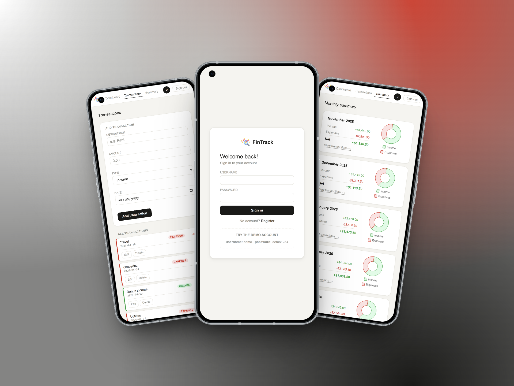
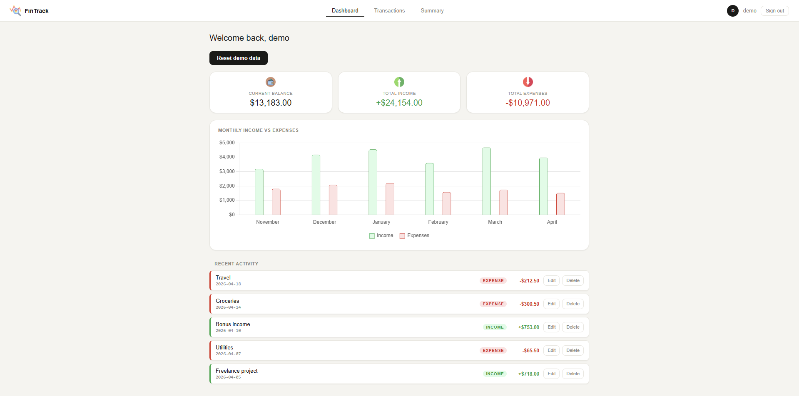

#  FinTrack

I built a personal finance tracker with Spring Boot. This is my first Java project and second project overall, built to practice full-stack web development.

---

Check out the live demo here → [Live Demo]()

## Preview





---

## What the app does

- Register and log in to your account
- Add, edit, and delete income/expense transactions
- Dashboard with your current balance, total income, and total expenses
- Bar chart showing monthly income vs expenses
- Browse all transactions with pagination
- Monthly summary page with a breakdown of each month and a donut chart
- Try it out with the built-in demo account

---

## Demo account

You can try the app without registering:

**Username:** demo  
**Password:** demo1234

The demo data resets every time you click the reset button, so feel free to add, edit or delete anything.

---

## What I used

- Java Spring Boot
- Spring Security for authentication
- Spring Data JPA with MySQL
- Thymeleaf for server-side HTML templates
- Chart.js for the charts
- CSS for custom styling

---

## How to run it

1. Clone the repository:

```bash
git clone https://github.com/banddreea/fintrack.git
cd fintrack
```

2. Create a MySQL database:

```sql
CREATE DATABASE fintrack;
```

3. Update `src/main/resources/application.properties` with your database details:

```
spring.datasource.url=jdbc:mysql://localhost:3306/fintrack
spring.datasource.username=your_username
spring.datasource.password=your_password
```

4. Run the project from your IDE or with Maven:

```
mvn spring-boot:run
```

5. Open your browser and go to `http://localhost:8080`

## Credits

Icons by Freepik, Three musketeers, and Flat Icons Design from https://www.flaticon.com
